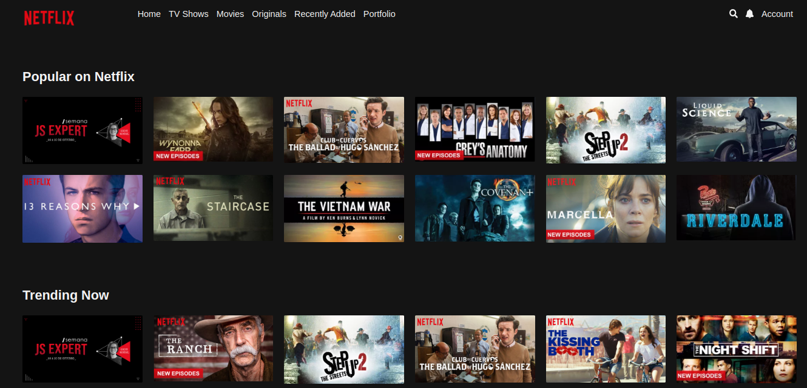
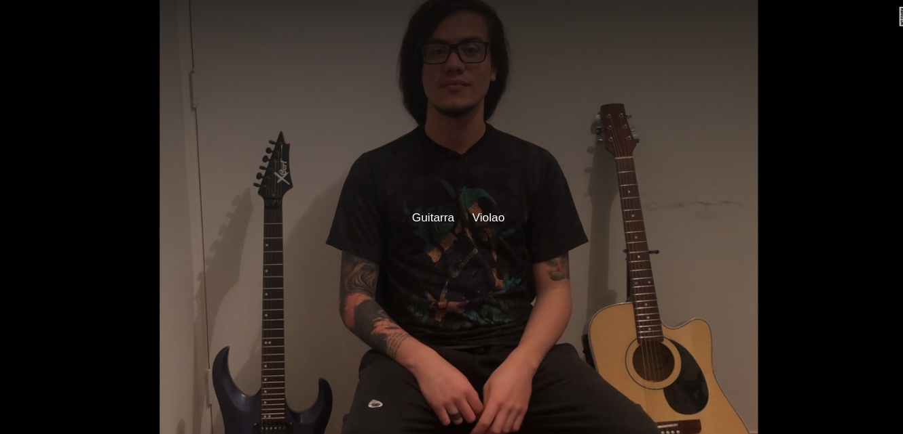

# Netflix Player (Black Mirror: Bandersnatch)

<p>
App para simular a forma como o Netflix produziu a serie Black Mirror Bandersnatch. A aplicação trata a entrega de conteúdo em streaming, do servidor para o browser, analisando o tempo para determinar qual a resolução de cada entrega. Além disso, antes do download do trecho seguinte, o usuário pode interagir com o vídeo selecionando uma opção
</p>

# Screens

<p align="center">
  
  
  
  
</p>

## Technologies used

- [Javascript](https://pt-br.reactjs.org)

## Requirements

You need to install both [Node.js](https://nodejs.org)

## How to use it

```bash
# Install the dependencies
$ npm install
# Run the video server
$ npm run assets
# Run the web server
$ npm run dev
```

The app will be available for access on your browser at (http://127.0.0.1:8080)
